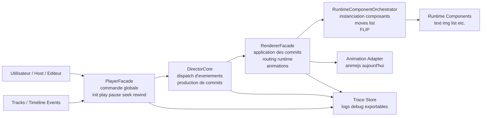

# Presentation accessible du moteur de sequence

Ce document presente le projet sous forme de slides lisibles par un public non technique ou semi-technique.

---

## Slide 1 - A quoi sert ce projet ?

Ce projet construit un moteur capable de jouer une scene interactive dans le temps.

En une phrase :

> on decrit une scene, des evenements, des reactions, puis le moteur decide quoi afficher, quand, et comment l'animer.

Ce moteur doit savoir gerer :

- une lecture chronologique classique
- des actions utilisateur en temps reel
- des changements d'etat pilotes par des evenements
- des animations automatiques et deterministes
- un mode debug pour comprendre ce qui s'est passe

---

## Slide 2 - Image mentale simple

Le moteur peut se lire comme une petite equipe :

- le `Player` tient le chrono et les commandes globales
- le `Director` decide quelles actions doivent partir
- le `Renderer` applique les changements visuels
- les composants runtime rendent chaque element concret
- l'adaptateur d'animation pilote les transitions

Image simple :

> `Player = chef d'orchestre`  
> `Director = regisseur logique`  
> `Renderer = equipe plateau`  
> `Components = acteurs / decors`  
> `Animation = mouvements et transitions`

---

## Slide 3 - Les grands objets metier

Le projet parle avec quelques briques stables.

### `Scene`

Le conteneur principal. Elle regroupe les stories, les pistes d'evenements et les regles globales.

### `Story`

Un bloc narratif autonome. On peut la lancer, la masquer, la mettre en pause, la reprendre.

### `Item` ou `Perso`

Un element affiche a l'ecran : texte, image, liste, media, etc.

### `Track`

Une piste temporelle contenant des evenements. Exemple : piste FR, piste EN, piste user.

### `Event`

Un signal date ou emis par l'utilisateur. Exemple : `click`, `show-title`, `play-voice`.

### `Action`

La reaction concrete d'un item a un evenement. Exemple : changer un style, deplacer un element, lancer une animation.

### `Strap`

Une brique logique sans rendu direct. Elle produit ou transforme de la donnee utile au runtime.

---

## Slide 4 - Ce qui se passe pendant un tick

Le moteur suit une chaine assez simple a comprendre :

1. le temps avance
2. le moteur recupere les evenements a traiter
3. il regarde qui ecoute ces evenements
4. il produit les actions a appliquer
5. il derive les transitions automatiques
6. il anime
7. il commit le rendu final

Version courte :

> `temps -> evenements -> decisions -> actions -> transitions -> animation -> rendu`

---

## Slide 5 - Pourquoi la notion de determinisme est centrale

Le moteur cherche a garantir :

> meme entree = meme comportement = meme resultat

Pourquoi c'est important :

- pour rejouer une scene de facon fiable
- pour debugger un bug sans comportement aleatoire
- pour enregistrer puis rejouer des evenements utilisateur
- pour garder un resultat stable entre l'editeur, les tests et le player

Concretement, le projet fixe :

- un ordre stable des evenements
- des regles explicites en cas de conflit au meme tick
- des traces runtime lisibles

---

## Slide 6 - Architecture tres visuelle

Lecture du schema :

- le `Player` pilote la session
- le `Director` transforme les evenements en travail concret
- le `Renderer` applique ce travail au runtime
- l'orchestrateur branche les composants et gere les cas complexes de deplacement
- le `Trace Store` garde une explication du comportement

---

## Slide 7 - Comment lire les trois couches principales

### Couche 1 - Pilotage

Le `Player` gere les commandes haut niveau : charger, jouer, mettre en pause, se deplacer dans le temps, reconstruire.

### Couche 2 - Decision

Le `Director` prend les evenements et determine quelles actions sont concernees.

### Couche 3 - Execution visuelle

Le `Renderer` et les composants runtime transforment ces decisions en modifications visibles a l'ecran.

Cette separation est une force du projet :

- on peut raisonner sur la logique sans melanger tout le DOM
- on peut tester le coeur sans navigateur reel
- on peut faire evoluer les composants sans reecrire le player entier

---

## Slide 8 - Le cas particulier du composant `list`

Le composant `list` est important car il ne fait pas qu'afficher des enfants.

Il doit aussi savoir gerer automatiquement :

- l'ajout d'un enfant
- la suppression d'un enfant
- le re-ordre d'un enfant
- le transfert d'un enfant d'une liste a une autre

Autrement dit :

> une `list` est a la fois un conteneur visuel et une zone de choreography.

Ce point est strategique car beaucoup d'interactions riches passent par des mouvements d'elements dans des listes ou pseudo-listes.

---

## Slide 9 - FLIP explique simplement

FLIP est une technique pour animer un deplacement sans effet de saut visuel.

Idee simple :

1. on mesure la position avant changement
2. on applique le nouvel ordre ou le nouveau parent
3. on mesure la position apres changement
4. on calcule l'ecart
5. on joue une animation qui compense cet ecart

Resultat recherche :

> l'utilisateur voit un mouvement fluide, meme si le DOM a ete recompose brutalement.

Dans ce projet, FLIP sert surtout a rendre fiables les mouvements de `list`, mais le modele peut etre reutilise par d'autres composants derives.

---

## Slide 10 - Zone sensible validee par le POC DOM

Une preuve importante a deja ete obtenue dans `src/demos/player-poc-demo.ts`.

Le POC valide un cas difficile :

- deux parents distincts
- parents detaches logiquement l'un de l'autre
- parents deja transformes (`transform`, `rotate`, `scale`)
- transfert d'enfants entre ces parents
- besoin d'un mouvement visuellement juste malgre ces transforms

Ce test a permis de valider le mode `flipMode: 'overlay-world'`, aujourd'hui branche notamment pour les moves de `list`.

Conclusion pratique :

> cette zone n'est pas un detail d'animation, c'est un invariant fonctionnel du projet.

---

## Slide 11 - Regle de vigilance pendant la construction du projet

Si une evolution touche l'un des points ci-dessous, il faut prevenir explicitement avant ou pendant la modification :

- `src/runtime/components/runtime-component-orchestrator.ts`
- `src/runtime/flip-engine/*`
- `src/runtime/components/list-runtime-component.ts`
- `src/demos/player-poc-demo.ts`
- tout comportement lie a `flipMode: 'overlay-world'`

Pourquoi :

- cette partie protege un cas DOM complexe deja valide
- elle sert directement au composant `list`
- elle pourra servir a d'autres composants derives plus tard
- une simplification naive peut faire revenir des sauts visuels ou des erreurs de geometrie

Tests minimum a relancer si cette zone bouge :

- `npm test`
- `npm run build`
- verification ciblee de `tests/lot17/player-demo-poc.spec.ts`
- verification ciblee de `tests/lot18/move-phase-c.spec.ts`
- si necessaire, verification manuelle via `npm run dev:demo`

---

## Slide 12 - Ou le projet en est aujourd'hui

La conception est plus avancee que l'implementation complete.

En clair :

- la vision metier est bien posee
- les briques techniques principales existent
- plusieurs sous-systemes critiques sont deja testes
- mais l'assemblage complet de la spec V1 reste encore partiel

Ce n'est pas un defaut de direction.

C'est plutot une situation normale de construction incremental :

- on verrouille d'abord les invariants difficiles
- on prouve les mecanismes critiques
- puis on elargit progressivement le moteur complet

Le POC FLIP/list fait justement partie de ces invariants deja verrouilles.

---

## Slide 13 - Forces de la conception

- separation claire entre pilotage, logique et rendu
- recherche explicite du determinisme
- decoupage compatible avec les tests
- systeme de traces utile pour le debug
- architecture assez modulaire pour accueillir de nouveaux composants
- traitement serieux des cas compliques de mouvement DOM

---

## Slide 14 - Points de vigilance de conception

- l'ecart reste important entre la spec complete et l'API effectivement exposee aujourd'hui
- certaines structures metier sont encore faiblement typees dans l'implementation courante
- la gestion scenario / straps / multistory / tracks avancees reste encore a assembler pleinement
- l'orchestrateur runtime concentre une forte complexite technique

Ces points ne remettent pas en cause le projet, mais ils indiquent ou l'effort de construction devra etre le plus rigoureux.

---

## Slide 15 - Resume en une minute

Le projet construit un moteur de sequence interactive qui doit etre :

- lisible
- modulaire
- deterministe
- testable
- capable de gerer des mouvements visuels complexes sans casser le DOM

Le coeur a retenir :

- `Player` pilote
- `Director` decide
- `Renderer` applique
- `list + FLIP` protegent les mouvements complexes
- `Trace Store` explique ce qui s'est passe

Point non negociable pendant la suite du chantier :

> ne pas casser la logique FLIP validee par le POC DOM, et signaler explicitement toute modification necessaire de cette zone.
