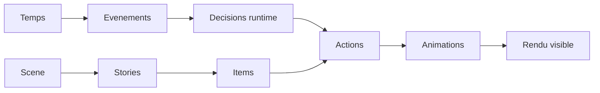
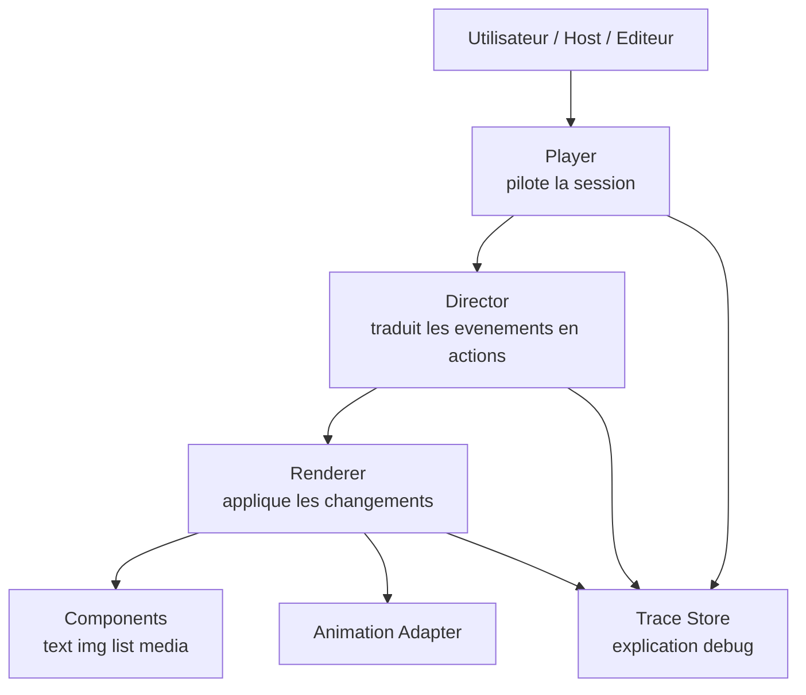

# Presentation visuelle du moteur de sequence

Version courte et visuelle, orientee partage, cadrage et discussion produit.

---

## Slide 1 - Le projet en une phrase

Le projet construit un moteur qui joue une scene interactive dans le temps.

Il sait :

- afficher des elements
- reagir a des evenements
- lancer des animations
- garder un comportement stable et comprehensible

Formule simple :

> une scene + un temps + des reactions = une experience interactive pilotee

---

## Slide 2 - L'image mentale

On peut voir le moteur comme un petit spectacle vivant.

- la `Scene` est la scene generale
- les `Stories` sont les sequences ou chapitres
- les `Items` sont les elements visibles
- les `Events` sont les signaux qui font bouger l'histoire
- le `Player` donne le tempo

Image simple :

> le moteur est un chef d'orchestre pour des elements visuels interactifs

---

## Slide 3 - Ce qu'il doit rendre possible

Le moteur doit pouvoir piloter des experiences comme :

- une intro qui avance toute seule
- un clic utilisateur qui change la suite
- une story d'attente qui s'ouvre temporairement
- des medias qui restent synchronises avec la sequence
- des listes d'elements qui se reorganisent proprement

L'objectif n'est pas seulement d'animer.

L'objectif est de raconter et controler une sequence interactive.

---

## Slide 4 - Les briques principales

### `Scene`

Le cadre global de l'experience.

### `Story`

Un bloc narratif ou fonctionnel qui peut vivre, s'arreter, reprendre.

### `Item`

Un element visible : texte, image, media, liste, etc.

### `Track`

Une piste d'evenements qui ajoute une couche temporelle.

### `Action`

Ce qu'un item fait quand un evenement arrive.

### `Trace`

Le journal qui explique ce que le moteur a decide et fait.

---

## Slide 5 - Le mouvement d'ensemble

Lecture simple :

- le temps avance
- des evenements deviennent actifs
- le moteur prend des decisions
- les items changent d'etat
- le rendu visible evolue a l'ecran

---

## Slide 6 - Architecture visuelle

Resume :

- le `Player` pilote
- le `Director` decide
- le `Renderer` execute
- les `Components` affichent
- le `Trace Store` raconte ce qu'il s'est passe

---

## Slide 7 - Pourquoi cette architecture est interessante

Elle separe clairement :

- le temps et les commandes
- la logique de decision
- le rendu visuel
- les composants concrets

Cela aide a :

- faire evoluer le moteur sans tout casser
- tester les comportements plus facilement
- comprendre les erreurs plus vite
- brancher de nouveaux composants plus tard

---

## Slide 8 - Le coeur de la promesse

Le moteur ne promet pas seulement du mouvement.

Il promet surtout :

- de la coherence dans le temps
- de la reactivite aux evenements
- de la stabilite de comportement
- de la lisibilite pour le debug

En version tres simple :

> si on rejoue la meme chose, on doit obtenir le meme resultat

---

## Slide 9 - Le role particulier des listes

Le type `list` est une brique importante.

Il permet de gerer des ensembles d'elements qui peuvent :

- apparaitre
- disparaitre
- changer d'ordre
- changer de conteneur

Pour l'utilisateur final, cela doit rester fluide et naturel.

Pour le moteur, c'est une capacite structurante, pas un simple effet visuel.

---

## Slide 10 - Ce qui est deja important a proteger

Certaines zones du moteur sont deja des points de confiance a preserver pendant la construction du projet.

En particulier :

- les mecanismes de mouvement visuel des listes
- la stabilite du rendu quand des elements changent de place
- la robustesse du POC de demonstration DOM

Regle simple :

> si cette zone doit changer, il faut le signaler clairement et reverifier son comportement

---

## Slide 11 - Ce que ce moteur apporte a un futur editeur

Un editeur ou un host pourra s'appuyer dessus pour :

- charger une scene
- lancer ou mettre en pause la lecture
- envoyer des evenements utilisateur
- observer l'etat runtime
- debugger les decisions du moteur

Autrement dit, le moteur est pense comme un socle reutilisable, pas comme une demo fermee.

---

## Slide 12 - Etat actuel du projet

La vision est deja claire.

Le chantier en cours consiste surtout a transformer cette vision en moteur complet et assemble de bout en bout.

Situation actuelle :

- le cadre conceptuel est solide
- plusieurs briques critiques existent deja
- la couverture de tests est utile
- l'integration complete de toute la spec reste a construire progressivement

---

## Slide 13 - Forces du projet

- vocabulaire metier clair
- architecture modulaire
- forte attention au determinisme
- systeme de traces pour comprendre le runtime
- bonne base pour un player, un editeur et des integrations futures

---

## Slide 14 - Points d'attention

- la spec complete est plus large que l'implementation actuelle
- certaines fonctions existent deja, mais pas encore toute la chaine complete
- la suite du chantier devra garder les invariants visuels et temporels deja prouves

Le bon cap n'est pas de tout refaire.

Le bon cap est :

> assembler progressivement le moteur complet sans perdre les garanties deja acquises

---

## Slide 15 - Conclusion

Ce projet vise un moteur capable de piloter une experience interactive de facon :

- claire
- modulaire
- fiable
- testable
- visuellement robuste

Message final :

> ce n'est pas seulement un player d'animations
> c'est un moteur de sequence interactive avec une ambition de coherence, de reactivite et de maitrise
