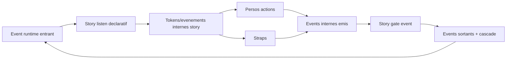

# Story model V1 - orchestration locale dans le Director

## But

Definir le role d'une `Story` dans le socle V1:

- orchestration locale deterministe
- consommation d'events runtime
- production de tokens internes et d'events runtime sortants
- compatibilite multi-stories actives

Le rendu est hors scope Story et reste de la responsabilite du `Renderer`.

## Position dans l'architecture

Le Player V1 est compose de `Director + Renderer + Timer + Ticker`.

Dans ce cadre:

- la `Story` est orchestree cote `Director`
- le `Director` gere state, listen, dispatch interne et emission publique
- le `Renderer` applique des commits deja resolus

Flux principal:

1. event runtime recu par le `Director`
2. filtrage/mapping inbound par les stories actives
3. resolution locale (persos/straps) et emission interne story
4. execution `straps` puis `emit` (si regle `listen` match)
5. propagation locale ou remontee parent/scene selon `cascade`
6. production de commits pour le `Renderer`

## Frontiere StoryDoc / runtime

`StoryDoc` reste descriptif.

- decrit le contenu (persos, actions, listen declaratif)
- ne porte pas le state runtime mutable
- contient les donnees statiques `initial` (potentiellement `undefined`)
- contient `init(input?)` pour initialiser le state runtime

Le state d'execution est runtime-only.

### Persos: creation runtime par type

- `StoryDoc` decrit les persos (`id`, `type`, `initial`, `actions`, `emit?`) sans creer de node
- la creation des elements runtime a partir de `perso.type` est hors scope Story
- cette creation est portee par le `Renderer` (au `load`) et retourne des `RuntimeElement`
- ordre de resolution cible: module custom (`ModuleRegistry`) puis noyau (`text`/`img`/`list`)
- en cas de type inconnu, le comportement depend de la policy runtime (deterministe)

Important:

- la logique `list` specialisee (`diff + FLIP + fallback perf`) reste dans le composant `list`
- cette logique ne migre ni dans la Story ni dans le pipeline runtime generique

## Role de la story

1. Unite locale de filtrage

- recoit les events runtime entrants
- decide ce qu'elle consomme via ses regles `listen`

2. Unite locale de transformation

- transforme un event entrant en un ou plusieurs tokens internes
- peut enrichir les donnees des tokens internes

3. Unite locale d'emission

- recoit les emissions internes des persos/straps
- decide explicitement ce qui ressort en event runtime
- peut republier tel quel ou transformer avant remontee
- emission immediate dans le meme cycle `Director`

4. Unite locale de state

- maintient son `Story.state` runtime-only
- expose des transitions locales pilotables par events

## Semantique `listen` V1

### Nature

- `listen` est declaratif et compilable
- `listen` n'est pas scriptable en V1
- `listen` fonctionne comme filtre

### Capacites

- mapping `1 -> N`
- renommage de signal
- enrichment de donnees
- canal `transform` pour transformer uniquement la `data`
- `straps` facultatifs sur chaque regle
- ordre par regle: `transform` puis `straps` puis `emit`
- ordre dans `straps`: gauche -> droite
- `listen=[]` = aucun filtrage (pass-through)

### Pipeline inbound/outbound

- inbound: `event runtime -> listen -> tokens/evenements internes`
- outbound: `emission interne perso/strap -> event runtime sortant`
- `cascade=false` (ou absent): portee locale
- `cascade=true`: remontee jusqu'a `Scene` sans interception intermediaire

### Interlocuteur unique scene

- `Perso` et `Strap` ne publient jamais directement vers la scene
- la `Story` est l'unique frontiere de repercussion event sortant

## Contrat V1 de reference

Le contrat normatif detaille de `Story` est porte par:

- `33-story-spec-v1.md`

Exemple d'intention:

- entree: `fire`
- sorties internes:
  - token `fire-base`
  - token `firework.create` avec data `{ quantity: 5 }`

### Portee

- les sorties `listen` sont des tokens internes story
- ces tokens ne sont pas journalises (derivables)

## Story state V1

### Regle principale

- `Story.state` est runtime-only
- `Story.state` peut rester `undefined` s'il n'est pas utilise

### Comportement seek/pause

- en `pause/seek`, le state est conserve par defaut
- `seek backward` par defaut est render-only (pas de rollback logique)

### Reset logique

- rollback logique complet via event `scene:replay-from-zero`

## Fin de story

Regles V1:

- une story se termine via event explicite `story:end`
- `story:end` est idealement emis par la story
- etat terminal sticky apres `story:end`
- une story sticky ne redevient active que par reset explicite ou replay depuis zero

## Straps dans la story

### Contrat V1

- un strap n'a pas de state propre
- un strap recoit un event/token + context
- un strap retourne des events (ou rien), pas une donnee metier directe

Regle:

- un strap ne publie jamais directement en scene-level
- ses `internalEvents` repassent par la story

### Replay `revoir`

- straps generateurs desactives
- side-effects externes bloques

Note:

- le detail de `context` reste ouvert a ce stade

## Multi-stories et instanciation

- plusieurs stories peuvent etre actives en parallele
- un enfant remonte automatiquement vers son parent
- une remontee globale passe par `cascade=true`
- un perso runtime appartient a une seule instance de story
- l'adressage runtime des cibles reste composite:
  - `(storyInstanceId, itemId, targetId?)`

## Determinisme et ordre

Le `Director` garantit:

- ordre canonique par `eventSeq` monotone global
- a egalite temporelle, `eventSeq` tranche
- emission d'events consequents dans le meme cycle avec `eventSeq` suivant

## Erreurs et policy

- les erreurs de logique auteur sont tracees comme erreurs auteur
- les reactions runtime (stop, continue, degrade) dependent de la policy d'execution
- les presets `author` et `user` viennent de la configuration (pas de hardcode)

## Invariants Story V1

1. Coherence listen

- regles `listen` compilables
- aucune sortie interne vide

2. Separation local/interne

- token interne = scope story uniquement
- event interne emis par perso/strap = scope story tant qu'il n'est pas exporte

3. State ownership

- state mutable de story uniquement cote runtime
- pas de state story mutable persiste dans `StoryDoc`

4. Fin sticky

- `story:end` bascule la story en terminal sticky

5. Determinisme

- meme entree runtime + meme state + meme policy => meme suite interne

6. Frontiere sortante unique

- aucune emission directe `perso/strap -> scene`
- toute repercussion sortante passe par la story

## Diagramme de flux

## Lien avec les autres specs

- `03-event-model.md`: enveloppe event, ordre global, journal
- `04-eventime-model.md`: compilation par track et production temporelle
- `06-runtime-contract.md`: contrat `Director -> Renderer`
