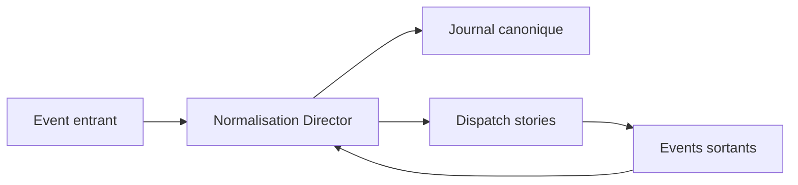

# Event model V1 - socle minimal

## But

Definir un modele d'event minimal, deterministe et suffisant pour le socle V1.

Le principe est de rester simple:

- champs indispensables seulement
- ordre canonique explicite
- extension possible plus tard

## Portee

Le modele couvre:

- events runtime traites par le `Director`
- journal canonique replay
- ordre d'execution scene-level et story-level

Il ne couvre pas encore:

- schema avance de correlation/telemetrie
- details riches de tracing

## Principe global

- un event entre dans un flux runtime unique
- les stories filtrent les events via `listen`
- `cascade` porte la remontee de l'event jusqu'a `Scene`
- aucun adressage nominatif de story

## Enveloppe minimale V1

Champs requis:

- `eventId`: identifiant d'event
- `eventSeq`: sequence monotone globale
- `name`: nom d'event
- `applyAtMs`: temps cible base sur le `Timer` commun
- `context`: origine runtime (`source`, `storyId?`, `persoId?`, `userEvent?`)
- `cascade`: propagation (`true` ou `false`)

Champs optionnels:

- `data`: payload metier/technique
- `meta`: bloc optionnel de debug

Regles V1:

- si `eventId` existe en entree, il est conserve
- sinon `eventId` est genere par le `Director`
- `eventSeq` est toujours assigne par le `Director`

## Ordonnancement canonique

Regle d'ordre:

1. `applyAtMs` croissant
2. a egalite, `eventSeq` croissant

Invariant:

- `eventSeq` tranche toujours les egalites temporelles

Regle track-specifique:

- un `tracks:set` de sequence `N` n'affecte que les events `> N`

## Journal canonique V1

Le journal canonique est tenu par le `Director`.

Regles:

- ecriture apres normalisation
- journalisation de tous les events runtime traites
- tokens internes de `listen` non journalises (derivables)

## Events locaux et remontee

- un event local reste dans le domaine story tant que `cascade=false`
- `cascade=true` remonte jusqu'a `Scene` sans interception intermediaire
- tokens internes story: scopes story, non journalises

Un token interne peut emettre un event runtime:

- emission immediate dans le meme cycle `Director`
- attribution du `eventSeq` suivant

## Erreurs auteur et validation

Exemples d'erreurs auteur V1:

- nom d'event vide
- format d'event invalide
- `tracks:set` avec track inconnue
- `tracks:set` avec meme track dans `activate` et `deactivate`

Reaction runtime:

- depend de la policy d'execution (`author`/`user`) via configuration

## Extensions eventuelles (hors V1 minimal)

Ces extensions ne sont pas un objectif de version predefini.

Elles seront introduites uniquement si un besoin concret apparait:

- correlation
- references de contexte enrichies
- traces fines par etape

Ces evolutions ne doivent pas casser le noyau minimal V1.

## Diagramme simple

## Lien avec les autres specs

- `02-story-model.md`: consommation locale et tokens internes
- `04-eventime-model.md`: production temporelle par track
- `06-runtime-contract.md`: passage vers commits renderer
