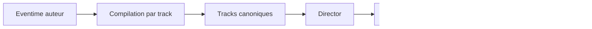

# Eventime model V1 - tracks et compilation minimale

## But

Definir un modele Eventime simple et deterministe pour V1.

Le principe retenu:

- expression auteur possible en structure recursive
- compilation canonique par track
- execution pilotee par events runtime

## Cadre diffusion V1

- `tracks` est obligatoire au niveau `Scene` en mode diffusion
- `tracks` peut etre vide (`{}`) si la sequence est principalement event-driven

## Position dans le Player

- les Eventimes sont traites cote `Director`
- le `Director` compile/ordonne les emissions runtime
- le `Renderer` ne consomme pas les Eventimes bruts

## Entree auteur

Le format auteur peut rester souple (y compris recursif).

Contrainte V1:

- toute entree Eventime est normalisee puis compilee en tracks canoniques

## Sortie compilee (canonique)

La sortie utile runtime est orientee track.

Chaque track compilee porte au minimum:

- `trackId`
- `order`
- `source`
- `active`
- `events[]` ordonnes

Dans ce modele V1, un `track` est lui-meme la ligne d'events pilotable.

Chaque event compile porte le noyau Event V1:

- `eventId`
- `name`
- `applyAtMs`
- `data?`

Puis, a l'execution, le `Director` assigne `eventSeq`.

## Regle de compilation par track

Regles V1:

1. normaliser l'entree auteur
2. aplatir/ordonner par track
3. produire une suite d'events canoniques
4. conserver un ordre stable a entree egale

Invariant:

- meme entree + meme config => meme resultat compile

## Ajout dynamique runtime

L'ajout dynamique est autorise en V1.

Contraintes:

- append-only
- uniquement via events runtime
- pas de mutation directe externe des structures runtime

Exemples d'ajout:

- ajout d'events a une track existante
- ajout d'une nouvelle track
- ajout d'events "live" pendant l'execution

## Controle activation tracks

Event canonique V1:

- `tracks:set`
- payload: `{ activate: string[]; deactivate: string[]; reason?: string }`

Validation V1:

- track inconnue => erreur auteur
- meme `trackId` dans `activate` et `deactivate` => erreur sur cette track
- traitement best-effort ordonne pour les autres operations

Semantique V1:

- desactivation = hard gate immediat
- reactivation sans rattrapage retroactif
- un `tracks:set` de sequence `N` n'affecte que les events `> N`

## Ordonnancement runtime

Ordre canonique des events runtime:

1. `applyAtMs`
2. `eventSeq` a egalite

Les events issus des tracks rejoignent le flux runtime global du `Director`.

## Events entrants (user/host)

Les events entrants (ex: issus de `Perso.emit`) passent aussi par le `Director`.

Pipeline V1:

1. normalisation event (`eventId`, `eventSeq`, `applyAtMs`, `context`)
2. routage vers gestionnaire Eventime
3. application Eventime uniquement si event de pilotage (ex: `tracks:set`)
4. insertion dans le flux runtime canonique
5. journalisation canonique

Invariant:

- un event utilisateur n'est pas un bypass Eventime/Director

## Replay, cache, seek

### Replay

- en `revoir`, la lecture se base sur le journal canonique
- la regeneration n'est pas confiee aux straps generateurs (desactives en `revoir`)

### Cache

- cache de lecture autorise
- invalidation possible selon events de pilotage (ex: langue)
- en V1, suppression physique des entrees invalides

### Seek

- `seek backward` par defaut: render-only
- pas de rollback logique story dans ce mode
- reset logique complet via `scene:replay-from-zero`

## Erreurs minimales V1

Erreurs auteur typiques:

- track inconnue referencee
- event sans `name`
- `applyAtMs` invalide

Reactions runtime:

- pilotees par la policy d'execution (`author`/`user`) via configuration

## Invariants Eventime V1

1. Compilation

- track-level canonique
- ordre stable et deterministe

2. Activation

- gate immediat par `active`
- pas de replay implicite des events manques

3. Integrite

- ajout dynamique uniquement par events runtime

4. Live

- les events live ajoutes en runtime restent soumis au meme ordonnancement canonique

## Diagramme simple

## Lien avec les autres specs

- `02-story-model.md`: consommation locale story
- `03-event-model.md`: enveloppe minimale et journal canonique
- `06-runtime-contract.md`: passage `Director -> Renderer`
