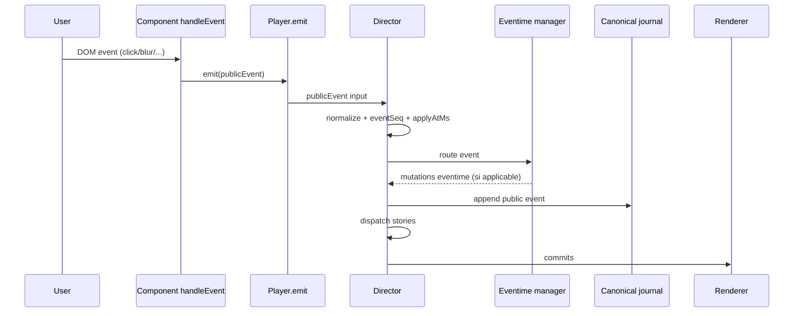

# User events emit V1

## Statut

Reference V1 pour l'emission d'events publics depuis les interactions utilisateur DOM.

Note de lecture V1 actuelle:

- document de transition (non normatif face au corpus `31-38` et `43-50`)
- `event public` y designe `event runtime`

## Preambule - intention

Un `Perso` peut declarer des interactions utilisateur sans script imperative.

Le but est de permettre:

- declaration simple dans le modele scene
- attachement automatique au `init` du composant
- emission d'events publics normalises vers le `Director`

## Portee

Ce document couvre:

- la propriete `emit` au niveau item (`Perso`)
- sa normalisation runtime
- l'attachement d'un `handleEvent(event)` au node DOM du composant
- la transformation interaction utilisateur -> events publics

Ce document ne couvre pas:

- les handlers auteur scriptables
- les gestures complexes multi-touch
- les policies avancees de throttling/debounce

## Position dans le modele item

`emit` est au meme niveau que `initial` et `actions`.

Exemple intentionnel:

```ts
type ItemDoc = {
  id: string
  type: string
  initial: Record<string, unknown>
  actions: Record<string, unknown>
  emit?: EmitDeclaration[]
}
```

## Schema declaratif V1

Format d'entree auteur:

- `emit` est une liste d'objets
- chaque objet porte une cle d'event DOM (`click`, `blur`, ...)
- la valeur contient au minimum `{ events: [...] }`

Type V1:

```ts
type EmitRule = {
  events: string[]
  data?: unknown
}

type EmitDeclaration = Record<string, EmitRule>
```

Exemple:

```ts
emit: [
  {
    click: {
      events: ['cta:clicked', 'metrics:cta'],
      data: { ctaId: 'hero-main' }
    }
  },
  {
    blur: {
      events: ['input:blurred']
    }
  }
]
```

## Normalisation runtime

Avant attachement DOM, le runtime normalise `emit` en structure exploitable:

- supprime les regles invalides
- garde l'ordre de declaration
- agrege par type d'event DOM

Structure normalisee recommandee:

```ts
type NormalizedEmitRule = {
  domEventName: string
  events: string[]
  data?: unknown
}

type NormalizedEmitMap = Map<string, NormalizedEmitRule[]>
```

## Attachement DOM au init composant

Regles V1:

- l'attachement des listeners se fait dans `init(initial)` du composant
- l'attachement cible le root node retourne ensuite par `render()`
- le listener utilise un objet `handleEvent(event)`

Contrat de handler recommande:

```ts
type EmitDomHandler = {
  handleEvent: (event: Event) => void
}
```

Pseudo-flux:

1. composant initialise son root node
2. composant construit `handler.handleEvent`
3. composant attache `addEventListener(domEventName, handler)` pour chaque event DOM declare

## Semantique handleEvent(event)

A reception d'un event DOM:

1. lire `event.type`
2. resoudre les regles `emit` associees
3. pour chaque regle, emettre tous les events publics declares dans `events[]`
4. injecter dans chaque event public:
   - `name` (nom de l'event public)
   - `source: 'user'`
   - `data` compose de:
     - `rule.data` (si present)
     - contexte minimum runtime

Contexte minimum recommande:

- `persoId`
- `domEventType`
- `eventTimestampMs`

Note:

- l'objet `Event` natif ne doit pas etre transmis brut en `data`

## Emission vers le Director

Les events emis par `emit` sont des events publics scene-level.

Regles:

- ils passent par le pipeline canonique `Player.emit(...) -> Director`
- `eventSeq` est assigne par le `Director`
- journalisation selon les regles de `03-event-model.md`

## Pipeline vers Eventime et journal

Apres `handleEvent(event)`, chaque event public emis suit ce pipeline:

1. `Player.emit(publicEventInput)`
2. normalisation `Director`:
   - validation minimale
   - generation/conservation `eventId`
   - attribution `eventSeq`
   - resolution `applyAtMs` avec le `Timer`
3. passage au gestionnaire Eventime (cote `Director`):
   - si l'event est un event de pilotage Eventime (ex: `tracks:set`), application des mutations Eventime
   - sinon, aucun changement Eventime structurel
4. insertion dans le flux public canonique du `Director`
5. dispatch vers stories actives
6. emission des commits vers `Renderer`

## Enregistrement (recording)

Regles V1:

- les events publics traites sont enregistres dans le journal canonique `Director`
- les tokens internes story ne sont pas enregistres
- les events de pilotage Eventime (`tracks:set`, etc.) suivent la meme regle de journalisation

Enregistrement complementaire (optionnel):

- un mirror de telemetrie/analytics peut etre active par policy runtime
- ce mirror est hors noyau canonique V1 et ne modifie pas l'ordonnancement

## Diagramme de sequence (simplifie)



## Policy d'erreur

Regle generale:

- modele permissif

Cas invalides:

- `emit` non liste
- objet de declaration sans cle DOM valide
- `events` absent, vide, ou non liste
- nom d'event public vide

Reaction:

- ignorer la regle invalide
- signaler warning auteur dedoublonne

## Warnings auteur recommandes

- `AUTHOR_EMIT_INVALID_SHAPE`
- `AUTHOR_EMIT_DOM_EVENT_UNKNOWN`
- `AUTHOR_EMIT_EVENTS_EMPTY`
- `AUTHOR_EMIT_EVENT_NAME_INVALID`

## Invariants V1

- `emit` ne remplace pas `actions`, il declenche des events publics
- `emit` est declaratif, sans callback script auteur
- `handleEvent` est attache au node composant au `init`
- l'ordre des events emis respecte l'ordre de declaration

## Exemple de flux complet

Declaration:

```ts
emit: [
  {
    click: {
      events: ['button:next'],
      data: { section: 'intro' }
    }
  }
]
```

Runtime:

1. user clique le node
2. `handleEvent({ type: 'click' })` est appele
3. runtime emet `button:next` avec `source: 'user'` et `data` enrichie
4. `Director` assigne `eventSeq` et dispatch

## Liens

- `03-event-model.md`
- `10-api-host-v1.md`
- `16-base-component-v1.md`
