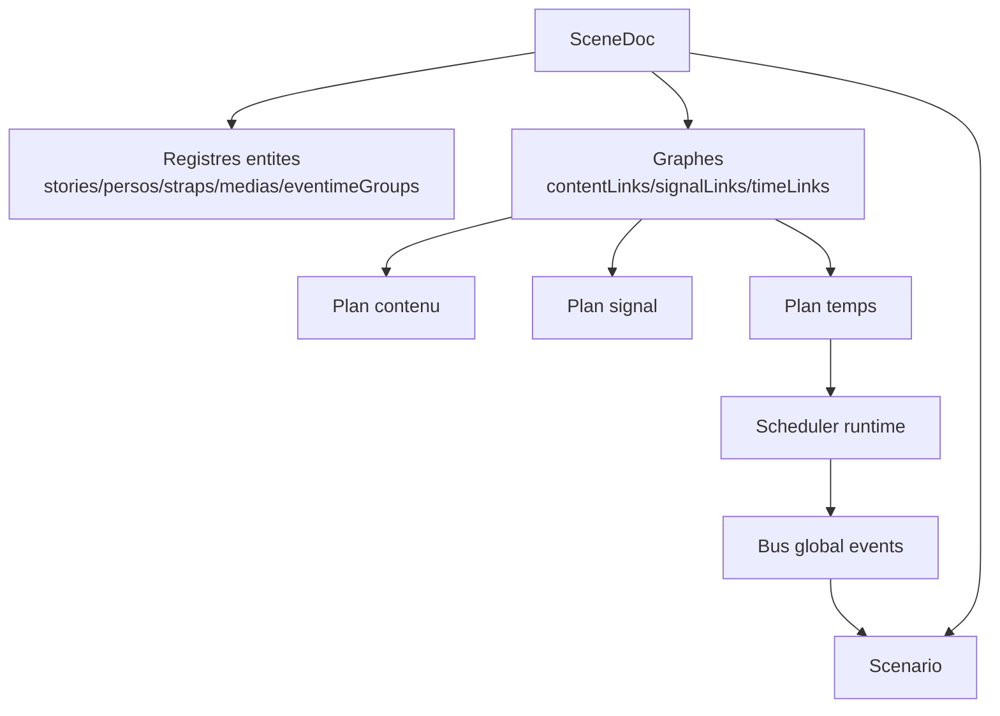

# Scene model - cadre general

## But

Fixer le role de `Scene` comme document racine declaratif qui assemble:

- le contenu (stories, persos, straps, medias)
- les flux de signaux (events)
- les sources temporelles (eventimes)
- le scenario narratif (transitions)

Ce document definit la structure et les invariants de haut niveau.
Les details Story/Event/Eventime seront precises dans les fichiers suivants.

## Intention de conception

Une `Scene` n'execute rien par elle-meme. Elle decrit un systeme.

- execution runtime: faite par le player/orchestrateur/scheduler
- document scene: serialisable, stable, versionnable
- aucune fonction runtime embarquee dans le document

La scene est donc un contrat de donnees, pas du code.

Une scene doit aussi etre pilotable par une orchestration parente (ex: `Chapter`, hors scope ici).
Elle expose donc un contrat I/O:

- entrees scene (events + parametres)
- sorties scene (events emis vers l'exterieur)

Contexte utilisateur:

- hors `SceneDoc`
- fourni par le player/environnement apres compilation
- applique au runtime via les entrees scene (`scene:param:*`, etc.)

Vocabulaire scene I/O V1 (fige pour le cadrage):

- entrees: `scene:start`, `scene:stop`, `scene:param:set`, `scene:param:patch`
- sorties: `scene:ready`, `scene:end`, `scene:request-next`, `scene:error`

## Vue logique (4 plans)

1. Plan contenu

- structure de composition: qui contient quoi
- ex: story -> persos, story -> straps, scene -> stories

2. Plan signal

- circulation des events entre producteurs et consommateurs
- ex: story emit -> autre story/strap

3. Plan temps

- groupes d'eventimes relies a un domaine temporel
- ex: cues relies au playhead d'un media

4. Plan scenario

- enchainement narratif par transitions d'events
- ex: node intro -> node form sur `story:intro:end`

Ces 4 plans coexistent dans la meme scene, mais restent distincts conceptuellement.

Decision V1:

- la scene supporte nativement plusieurs stories actives en parallele
- le modele scene ne presuppose pas une story active unique
- les transitions scenario sont additives par defaut
- l'arret de story est explicite (pas d'arret implicite global)
- un perso est exclusif a une story (pas de multi-reference inter-stories)
- l'instanciation de story duplique les persos (pas de partage d'instance)
- les straps supportent deux modes explicites: global partage (etat commun) ou local copie (etat separe)
- un strap global partage est reset par defaut au `scene:start`

## Structure cible (niveau SceneDoc)

`SceneDoc` contient les registres et les graphes necessaires.

- identite
  - `id`: identifiant scene
  - `version`: version de schema scene
  - `meta` (optionnel): informations auteur/outils

- registres d'entites
  - `stories`
  - `persos` (concept metier; runtime pourra parler d'items)
  - `straps`
  - `medias`
  - `eventimeGroups`

- graphes
  - `contentLinks`: liens de composition
  - `signalLinks`: liens d'emission/consommation d'events
  - `timeLinks`: liens eventimes -> domaine temporel

- orchestration narrative
  - `scenario`

- contrat scene I/O
  - `inputs` (events/params acceptes)
  - `outputs` (events emis)

## Invariants globaux de scene

1. Integrite des identifiants

- chaque registre est indexe par ID unique
- l'ID de l'objet doit matcher sa cle de registre
- aucun ID vide

2. Integrite des references

- tout `from`/`to` de lien doit pointer vers une entite existante
- tout domaine temporel reference par un `timeLink` doit exister
- toute story referencee dans `scenario` doit exister

3. Coherence des plans

- un lien de type `content` ne transporte pas d'information temporelle
- un lien de type `time` ne transporte pas de regle narrative
- un lien de type `signal` ne cree pas de relation de composition

4. Determinisme declaratif

- ordre de declaration preserve pour les cas d'egalite de priorite
- aucune ambiguite de cible au chargement
- aucune execution implicite cachee dans la structure

5. Coherence multi-stories

- les regles de scene doivent rester valides quand plusieurs stories sont actives simultanement
- les collisions d'effets doivent etre resolues par policies explicites (pas implicites)
- une transition qui ne mentionne pas d'arret ne doit pas retirer une story active
- un perso ne doit jamais avoir deux stories proprietaires en meme temps

6. Integrite d'instanciation

- chaque instance de story possede ses propres IDs runtime de persos
- aucune reference partagee de perso entre instances actives
- les IDs runtime doivent etre derives de facon deterministe (pas d'IDs opaques aleatoires par defaut)

7. Separation controle/runtime

- events metier et events techniques ne se melangent pas sans convention explicite
- prefixes reserves runtime proteges (`player:*`, `runtime:*`, `system:*`, etc.)

8. Integrite scene I/O

- les events declares en `inputs`/`outputs` doivent respecter les conventions de nommage
- les parametres d'entree doivent etre validables
- la scene peut fonctionner en mode standalone (sans parent) ou integree (avec parent)

## Typologie des liens (scene-level)

1. `contentLink`

- role: composition/lifecycle
- ex: `story-form` contient `btn-submit`

2. `signalLink`

- role: circulation d'events entre entites
- ex: `story-form` emet `story:form:end` vers `story-outro`

3. `timeLink`

- role: rattacher un groupe d'eventimes a un domaine de temps
- ex: `eventimeGroup-intro` rattache a `media:intro#1`

## Frontieres de responsabilite

Scene (document):

- decrit les entites et leurs relations
- fixe les contraintes de validite

Runtime (execution):

- valide puis compile la scene
- echantillonne les domaines temporels
- emet des events discrets depuis les eventimes
- applique le scenario et les actions

## Chargement d'une scene (vision generale)

1. Validation structurelle

- schema, IDs, references, types de liens

2. Validation semantique

- coherences inter-plans (scenario/content/signal/time)
- collisions de noms/events reserves

3. Compilation runtime

- index de resolution des refs
- tables de routage signal
- plans scheduler pour eventimes

4. Initialisation

- activation du node scenario initial
- activation des stories initiales selon la policy d'orchestration

## Points de vigilance deja identifies

- eviter de recreer une temporalite implicite au niveau story
- garder les eventimes lies a un domaine explicite
- eviter les doublons conceptuels entre graphe signal et scenario
- maintenir une etape d'ingress story minimale et explicite

## Diagramme conceptuel

## Sortie attendue pour la suite

Les prochains documents doivent maintenant preciser:

- modele Story (ingress, bus interne, emission)
- modele Event (noms, namespace, enveloppe event)
- modele Eventime (domaines, regles de franchissement, scheduler)
- articulation finale avec le scenario
