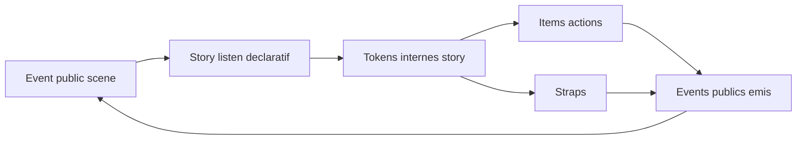

# Story model V1 - orchestration locale dans le Director

## But

Definir le role d'une `Story` dans le socle V1:

- orchestration locale deterministe
- consommation d'events publics scene-level
- production de tokens internes et d'events publics
- compatibilite multi-stories actives

Le rendu est hors scope Story et reste de la responsabilite du `Renderer`.

## Position dans l'architecture

Le Player V1 est compose de `Director + Renderer + Timer + Ticker`.

Dans ce cadre:

- la `Story` est orchestree cote `Director`
- le `Director` gere state, listen, dispatch interne et emission publique
- le `Renderer` applique des commits deja resolus

Flux principal:

1. event public recu par le `Director`
2. filtrage/mapping par les stories actives
3. resolution locale (items/straps)
4. emission d'events publics eventuels
5. production de commits pour le `Renderer`

## Frontiere StoryDoc / runtime

`StoryDoc` reste descriptif.

- decrit le contenu (items, actions, listen declaratif)
- ne porte pas le state runtime mutable
- ne contient pas de hook `init` scriptable en V1

Le state d'execution est runtime-only.

## Role de la story

1. Unite locale de filtrage

- recoit tous les events publics
- decide ce qu'elle consomme via ses regles `listen`

2. Unite locale de transformation

- transforme un event public en un ou plusieurs tokens internes
- peut enrichir les donnees des tokens internes

3. Unite locale d'emission

- peut emettre des events publics a partir de traitements internes
- emission immediate dans le meme cycle `Director`

4. Unite locale de state

- maintient son `Story.state` runtime-only
- expose des transitions locales pilotables par events

## Semantique `listen` V1

### Nature

- `listen` est declaratif et compilable
- `listen` n'est pas scriptable en V1

### Capacites

- mapping `1 -> N`
- renommage de signal
- enrichment de donnees

Exemple d'intention:

- entree publique: `fire`
- sorties internes:
  - token `fire-base`
  - token `firework.create` avec data `{ quantity: 5 }`

### Portee

- les sorties `listen` sont des tokens internes story
- ces tokens ne sont pas publics
- ces tokens ne sont pas journalises (derivables)

## Story state V1

### Regle principale

- `Story.state` est runtime-only

### Comportement seek/pause

- en `pause/seek`, le state est conserve par defaut
- `seek backward` par defaut est render-only (pas de rollback logique)

### Reset logique

- rollback logique complet via event public `scene:replay-from-zero`

## Fin de story

Regles V1:

- une story se termine via event public explicite `story:end`
- `story:end` est idealement emis par la story
- etat terminal sticky apres `story:end`
- une story sticky ne redevient active que par reset explicite ou replay depuis zero

## Straps dans la story

### Contrat V1

- un strap n'a pas de state propre
- un strap recoit un event/token + context
- un strap retourne un resultat de type:
  - `statePatch`
  - `events`
  - `sideEffects`

### Replay `revoir`

- straps generateurs desactives
- side-effects externes bloques

Note:

- le detail de `context` reste ouvert a ce stade

## Multi-stories et instanciation

- plusieurs stories peuvent etre actives en parallele
- les events publics sont diffuses globalement
- un perso runtime appartient a une seule instance de story
- l'adressage runtime des cibles reste composite:
  - `(storyInstanceId, itemId, targetId?)`

## Determinisme et ordre

Le `Director` garantit:

- ordre canonique par `eventSeq` monotone global
- a egalite temporelle, `eventSeq` tranche
- emission d'events publics consequents dans le meme cycle avec `eventSeq` suivant

## Erreurs et policy

- les erreurs de logique auteur sont tracees comme erreurs auteur
- les reactions runtime (stop, continue, degrade) dependent de la policy d'execution
- les presets `author` et `user` viennent de la configuration (pas de hardcode)

## Invariants Story V1

1. Coherence listen

- regles `listen` compilables
- aucune sortie interne vide

2. Separation public/interne

- event public = scope scene
- token interne = scope story uniquement

3. State ownership

- state mutable de story uniquement cote runtime
- pas de state story mutable persiste dans `StoryDoc`

4. Fin sticky

- `story:end` bascule la story en terminal sticky

5. Determinisme

- meme entree publique + meme state + meme policy => meme suite interne

## Diagramme de flux

## Lien avec les autres specs

- `03-event-model.md`: enveloppe event, ordre global, journal
- `04-eventime-model.md`: compilation par track et production temporelle
- `06-runtime-contract.md`: contrat `Director -> Renderer`
