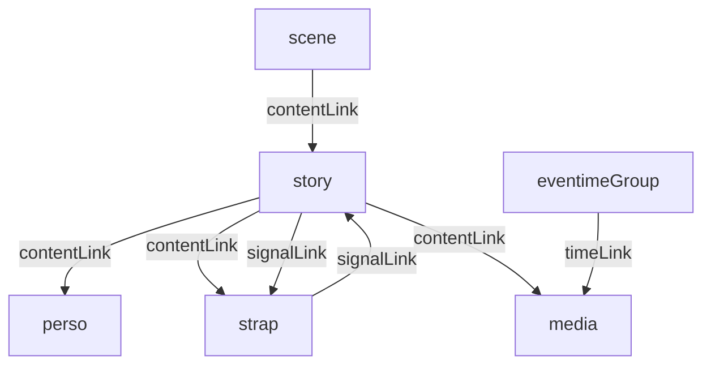

# Graph model - composition, signaux, temps

## But

Formaliser un graphe unique de scene, avec des liens types, pour representer:

- la composition du contenu
- la circulation des events
- les dependances temporelles

Ce modele sert de base commune a l'API, a l'editeur visuel et au compilateur de scene.

## Intention

Eviter les ambiguities en separant les natures de relation.

Une meme paire de noeuds peut etre reliee de plusieurs facons, mais jamais avec une semantique implicite.

- un lien de contenu ne transporte pas d'event
- un lien signal ne cree pas de parentage
- un lien temps ne decrit pas une transition narrative

## Noeuds du graphe

Le graphe reference des noeuds typés:

- `scene`
- `story`
- `perso`
- `strap`
- `media`
- `eventimeGroup`
- `scenarioNode`

Chaque noeud a un ID stable et un type explicite.

## Familles de liens

1. `contentLink`

- role: composition et cycle de vie logique
- exemple: `story-form` contient `btn-submit`
- champs minimaux: `from`, `to`
- champs optionnels clarifies:
  - `order`: entier utilise pour ordonner les enfants d'un meme parent
  - `slot`: nom de point d'attache quand le parent expose plusieurs zones de contenu

2. `signalLink`

- role: propagation d'events entre producteurs et consommateurs
- exemple: `story-form` emet `story:form:end` vers `story-outro`
- champs minimaux: `from`, `to`, `event`
- interpretation: `from` est la source, `to` est la cible (pas de champ `direction` requis)

3. `timeLink`

- role: rattacher un `eventimeGroup` a un domaine temporel
- exemple: `group:intro-cues` -> `media:intro#1`
- champs minimaux: `from`, `to`
- interpretation: `from` doit etre un `eventimeGroup`; `to` doit exposer un domaine de temps (`media`, `story` ou `session`)

4. `scenarioLink` (option de lisibilite)

- role: rendre explicites les transitions narratives entre `scenarioNode`
- exemple: `node-intro` -> `node-form` sur `story:intro:end`
- champs minimaux: `from`, `to`, `event`
- champ optionnel: `priority` pour departager plusieurs transitions eligibles

## Invariants de graphe

1. Integrite de base

- chaque lien a un `kind` reconnu
- `from` et `to` doivent exister
- les types de noeuds doivent etre compatibles avec le `kind`

2. Compatibilite par type de lien

- `contentLink`: source autorisee `scene|story|perso` selon politique de composition; cible `story|perso|strap|media`
- `signalLink`: source/cible autorisees `story|strap|player|scenarioNode` selon contrat
- `timeLink`: source `eventimeGroup`; cible `media|story|session`

Contraintes supplementaires sur `contentLink`:

- un noeud `perso` doit avoir une seule story proprietaire a un instant donne
- un `perso` ne peut pas etre cible de deux `contentLink` provenant de deux stories differentes
- l'instanciation de story cree des copies de persos (pas de partage de noeud perso entre instances)
- un noeud `strap` peut etre de mode local (copie par story) ou global (partage multi-stories)
- le mode strap doit etre explicite pour lever toute ambiguite d'etat

3. Acyclicite controlee

- cycle interdit dans le plan contenu (eviter parentage infini)
- cycle autorise dans le plan signal si explicite et borne par runtime policies

4. Determinisme

- ordre de declaration preserve pour ties
- si priorite existe, elle est comparee avant ordre de declaration

5. Separation des plans

- une validation doit detecter les melanges de semantique (ex: eventName pose sur contentLink)
- une validation doit detecter les melanges de semantique (ex: champ `event` sur un `contentLink`)

## Vue multi-graphe (edition)

Pour garder la lisibilite, l'editeur montre des vues separees sur le meme modele:

1. Vue contenu

- stories, persos, straps, medias
- uniquement `contentLink`

2. Vue signal

- producteurs/consommateurs d'events
- uniquement `signalLink`
- entrees/sorties explicites par noeud

3. Vue temps

- eventime groups et domaines
- uniquement `timeLink`

4. Vue scenario

- transitions narratives entre scenario nodes

## Entrees/sorties par noeud

Chaque noeud expose ses ports logiques.

1. Scene

- `IN`: events/parametres recus depuis orchestration parente
- `OUT`: events emis vers orchestration parente

2. Story

- `IN`: events globaux recus puis normalises par l'ingress story
- `OUT`: events emis par ses actions/straps locaux

3. Strap

- `IN`: events internes/globaux selon rattachement
- `OUT`: events produits (metier/techniques)

4. Eventime group

- `IN`: progression temporelle du domaine
- `OUT`: events discrets sur cues franchis

5. Media (domaine)

- `IN`: commandes playback
- `OUT`: playhead + events media techniques

## Validation de ports

Regles de base recommandees:

- un `signalLink` doit relier un `OUT` vers un `IN`
- un event attendu en `IN` doit exister dans le vocabulaire emis de la source (ou etre wildcard explicitement autorise, si supporte)
- les `timeLink` ne peuvent pas cibler un noeud sans horloge exposable

## Place du scenario dans le graphe

Deux strategies sont possibles:

1. Scenario externe au graphe principal

- le scenario reste dans un bloc dedie, reference des stories et events
- plus simple pour V1

2. Scenario comme sous-graphe

- `scenarioNode` devient un noeud type
- transitions scenario deviennent des `scenarioLink`

Recommandation V1:

- garder le scenario en bloc dedie, avec projection visuelle en vue scenario
- eviter de complexifier trop tot le graphe general

## Erreurs de validation typiques

- `GRAPH_LINK_SOURCE_NOT_FOUND`
- `GRAPH_LINK_TARGET_NOT_FOUND`
- `GRAPH_LINK_KIND_INVALID`
- `GRAPH_CONTENT_CYCLE_DETECTED`
- `GRAPH_PERSO_MULTIPLE_STORY_OWNER`
- `GRAPH_INSTANCE_PERSO_SHARED_REFERENCE`
- `GRAPH_TIME_DOMAIN_INVALID`
- `GRAPH_PORT_DIRECTION_INVALID`

## Diagramme conceptuel (liens types)

## Consequence pour l'architecture

Le compilateur de scene doit produire, a partir de ce graphe:

- une table de composition (mount/lifecycle)
- une table de routage signal (emit -> consume)
- une table de scheduling temporel (group -> domain -> cues)
- un plan scenario (node/transitions)

Ce decoupage garantit une execution claire cote player, sans perdre la richesse du modele auteur.
