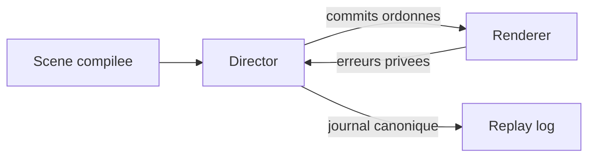

# Runtime contract V1 - Builder, Director, Renderer

## But

Fixer le contrat runtime minimal V1 entre:

- `Builder` (compilation)
- `Director` (orchestration eventielle)
- `Renderer` (execution rendu/media)

Le contrat privilegie la simplicite, le determinisme et la separation des responsabilites.

## Architecture cible

Composition du Player:

- `Player = Director + Renderer + Timer + Ticker`

Flux principal:

1. `Builder` compile vers une structure consommable runtime
2. `Director` traite les events publics, maintient le state, produit des commits
3. `Renderer` applique les commits et retourne uniquement les erreurs

## Responsabilites

### Builder

- valider les structures auteur
- compiler Eventimes en tracks canoniques
- preparer des descripteurs exploitables par le runtime
- garantir un resultat deterministe a entree egale

Le Builder ne doit pas:

- executer la boucle runtime
- faire du rendu
- orchestrer les cycles d'events en temps reel

### Director

- normaliser tous les events publics
- conserver ou generer `eventId`
- assigner `eventSeq` monotone global
- tenir le journal canonique replay
- appliquer `listen`, state story, straps
- emettre des events publics consequents
- produire des commits resolus vers le Renderer
- appliquer les policies runtime via configuration

### Renderer

- recevoir des commits deja resolus et ordonnes
- appliquer les operations ciblees par frame
- respecter `commitSeq` et `applyAtMs`
- retourner les erreurs via canal API prive vers Director

Le Renderer ne doit pas:

- redecider la logique metier story
- recompiler des tracks/eventimes
- servir de source de verite replay

## Contrat de creation des elements par type

Ce contrat est re-ouvert et reste dans le perimetre V1.

Entree minimale cote runtime:

- item compile: `id`, `type`, `initial`, `actions`, options composant eventuelles

Sortie minimale cote runtime:

- `RuntimeElement = { runtimeItemId, nodeRef, plugins? }`

Resolution de `item.type` (ordre canonique):

1. type custom resolu via `ModuleRegistry` (si declaration presente)
2. fallback noyau: `text`, `img`, `list`
3. type inconnu: comportement defini par policy runtime (strict/warn/fallback)

Contraintes:

- le `Director` ne connait pas la construction de node
- le `Renderer` construit et detruit les nodes/modules dans son cycle de vie
- le runtime manipule le root du perso; le module custom reste maitre de son rendu interne

Extension custom (V1 cible):

- forme recommandee: classe module instanciee par perso runtime
- lifecycle cible: `init` / `start` / `update` / `render` / `destroy`
- `render(...)` doit retourner un root stable pilotable par le runtime
- `actions[*].cmd` est route vers le module, sans logique metier ajoutee au `Director`

Cas `list`:

- `type='list'` active un composant dedie
- la logique `diff + FLIP + fallback perf` est portee par ce composant
- le pipeline runtime generique reste limite a l'application des commits

## Contrat d'echange Director -> Renderer

Chaque commit V1 inclut:

- `commitSeq` monotone global
- `applyAtMs` (reference `Timer` commun)
- operations ciblees (patch/diff)
- adressage composite `(storyInstanceId, itemId, targetId?)`
- `causeEventId` optionnel (debug)

Regles d'application:

- ordre strict par `commitSeq`
- commit en retard applique a la prochaine frame
- si buffer non vide, report au tick suivant en conservant l'ordre
- tous les commits prets sont appliques au tick
- application atomique par frame

## Contrat event runtime

Enveloppe minimale V1:

- `eventId`
- `eventSeq`
- `name`
- `applyAtMs`
- `source`
- `data?`
- `meta?`

Regles:

- `eventId` conserve s'il existe en entree, sinon genere
- `eventSeq` toujours assigne par le Director
- ordre canonique: `applyAtMs`, puis `eventSeq`

## Tracks et Eventimes

- compilation canonique par track
- ajout dynamique runtime append-only
- ajout dynamique uniquement via events publics

Controle canonique:

- `tracks:set`
- payload: `{ activate: string[]; deactivate: string[]; reason?: string }`

Validation:

- track inconnue: erreur auteur
- meme track dans `activate` et `deactivate`: erreur sur cette track
- traitement best-effort ordonne pour le reste

Semantique:

- desactivation immediate (hard gate)
- pas de rattrapage retroactif a la reactivation
- un `tracks:set` de sequence `N` n'affecte que les events `> N`

## Story lifecycle runtime

- `Story.state` runtime-only
- `listen` declaratif compilable, mapping `1 -> N`
- sorties `listen` internes (non publiques, non journalisees)
- emission publique immediate possible depuis un token interne
- fin explicite via `story:end`
- etat terminal sticky apres `story:end`

## Replay, cache, seek

Journal canonique:

- tenu par le Director
- ecriture apres normalisation
- tous les events publics traites sont journalises

Modes:

- `refaire`
- `revoir`

En `revoir`:

- straps generateurs desactives
- side-effects externes bloques

Seek V1:

- `seek backward` par defaut render-only
- pas de rollback logique story en mode state preserve
- rollback logique complet via `scene:replay-from-zero`

Cache:

- invalidation possible selon events de pilotage
- suppression physique des entrees invalides en V1
- `eventSeq` et `commitSeq` continuent de croitre

## Configuration et policies

Les policies sont portees par un dossier de configuration dedie.

Couches de priorite:

1. defaults framework
2. preset environnement (`author` / `user`)
3. config projet/scene
4. patch runtime

Regles:

- aucune regle critique en dur
- `author`/`user` sont des presets, pas des branches hardcodees

## Contraintes implementation cible

- timers legacy proscrits pour la cible finale
- boucle cible: `rAF + queue + commit`
- details des bibliotheques tierces hors contrat V1

## API et code style (rappel V1 recommande)

- facade d'API formelle requise au niveau `Player` (API host)
- communication interne `Director`/`Renderer`/`Timer`/`Ticker` libre tant que le determinisme est preserve
- pour les hot paths runtime, privilegier des appels directs et structures de donnees simples
- methodes `register*` reservees aux besoins d'extensibilite explicites
- fonctions/classes documentees
- constantes/config privilegiees aux valeurs en dur
- verification par tests smoke en sous-ensembles par sujet

## Diagramme simple

## Lien avec les autres specs

- `02-story-model.md`
- `03-event-model.md`
- `04-eventime-model.md`
- `10-api-host-v1.md`
