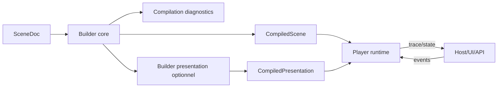

# Runtime contract - builder et player

## But

Definir la frontiere entre:

- le `builder` (compilation de scene)
- le `player` (execution runtime)

Ce document fixe qui fait quoi, ce qui doit rester stable, et ce qui est optionnel selon l'integration.

## Intention

Eviter un bloc unique qui melange:

- modelisation auteur
- compilation
- execution temps reel
- presentation web specifique

Le contrat cible: `SceneDoc` -> `CompiledScene` -> execution player.

## Composants

1. Builder core (obligatoire)

- valide et compile `SceneDoc`
- produit `CompiledScene`
- ne depend pas du moteur de rendu final

2. Builder presentation (optionnel)

- derive des artefacts de presentation (ex: classes CSS, tokens style)
- enrichit les refs de presentation dans `CompiledScene`
- reste detachable du coeur narratif

3. Player runtime (obligatoire)

- consomme `CompiledScene`
- execute l'orchestration event-driven
- pilote media, animation, scenario, rendu

4. Host adapter (integration)

- pont avec UI, backend, telemetry, tooling
- emet les events utilisateur
- recupere traces/diagnostics
- peut jouer le role d'orchestrateur parent de scene

## Responsabilites du builder core

- validation structurelle (IDs, refs, liens, scenario)
- validation semantique (coherences contenu/signal/temps)
- compilation des tables de composition
- compilation du routage signal
- compilation des plans eventimes (groupes, domaines, cues)
- compilation du scenario (nodes, transitions, priorites)
- production de diagnostics de compilation

Le builder core ne doit pas:

- executer de tick runtime
- instancier des nodes de rendu
- lancer les medias
- evaluer des transitions en temps reel

## Responsabilites du player runtime

- charger `CompiledScene`
- resoudre les modules de types custom via un registry runtime
- maintenir l'etat runtime (stories, medias, scenario, tracks)
- collecter/ordonner les events
- transformer les cues eventimes franchis en events discrets
- dispatcher les events vers les listeners compiles
- appliquer les actions resolues
- gerer la boucle d'execution et le commit rendu
- exposer trace et diagnostics runtime

Le player runtime ne doit pas:

- refaire la compilation semantique complete de la scene
- recalculer les graphes auteur a chaque tick

## Contrat d'entree/sortie

Entree builder:

- `SceneDoc`
- options de compilation (mode, validations strictes, flags)

Sortie builder:

- `CompiledScene`
- `CompilationDiagnostics`
- optionnel: `CompiledPresentation`

Sorties export builder (differees):

- `PlayerExportPackage`: package de diffusion pour player (scene compilee + dependances)
- `LegacyExportArtifact`: sortie de conversion vers format legacy cible (ex: XML) + rapport de conversion

Decisions V1:

- `PlayerExportPackage` en mode par defaut bundle complet
- versionnement d'artefact via schema semver
- resolution assets par defaut offline-first
- `LegacyExportArtifact` en mode par defaut degrade + rapport
- mode strict legacy optionnel (fail-fast) activable par policy d'export
- phase debug prioritaire: logs/rapports de conversion detailles
- durcissement integrite (hash/signature) reporte a la phase diffusion
- logs debug export legacy inclus dans l'artefact (ndjson + resume + mapping + rapport humain)

Entree player:

- `CompiledScene`
- `PlayerConfig` (mode debug/player, policies runtime)
- `RuntimeContext` fourni par le player/environnement (post-compilation)
- `ModuleRegistry` (types custom -> modules d'implementation)
- events/parametres entrants depuis l'orchestrateur parent

`RuntimeContext` (principes):

- ne fait pas partie du `SceneDoc`
- ne fait pas partie des valeurs internes de `CompiledScene`
- transporte les conditions d'execution (ex: mode replay, profil utilisateur, contexte de session)

`RuntimeContext` minimal V1:

- `replayMode`: `refaire | revoir` (defaut `refaire`)
- `locale` (optionnel)
- `sessionKind`: `live | replay` (optionnel)
- `inputProfile`: `web | mobile | kiosk` (optionnel)
- `seed` (optionnel)

`ModuleRegistry` (principes):

- hors `SceneDoc`
- fourni par integration player
- associe un `item.type` custom a un module executable

Contrat module runtime V1:

- une classe module est instanciee par perso runtime
- cycle minimal: `init(initInput)` -> `start()` -> `update(updateInput)` -> `render(renderInput)` -> `destroy()`
- `emit(event)` est injecte par le player pour publier sur le bus global
- les commandes d'action arrivent via `action.cmd`
- `action.cmd` porte ses champs metier directement (sans enveloppe `payload` dediee)
- les events techniques cibles (`viewport:*`) peuvent etre routes vers `update()`
- `render(renderInput)` retourne le noeud racine du module

Routage player/module des actions standards:

- mode `root-only`: player applique sur le noeud racine du module
- mode `exposed-targets`: module expose des cibles internes adressables
- le player applique `move/style/attr/class` sur la cible resolue
- cible introuvable: action ignoree + diagnostic runtime

Separation des responsabilites d'action:

- player: applique les actions standard sur le noeud racine ou les cibles exposees (position, taille, style, classes)
- module: orchestre ses sous-noeuds et son rendu interne (ex: canvas three.js, div+svg)

Projection runtime vers la scene:

- le player derive `initialSceneParams` depuis `RuntimeContext`
- il injecte ces params via `scene:param:set` avant `scene:start`
- validation des params par le contrat d'entree scene

Catalogue mapping V1 (minimal):

- `replayMode` -> `scene.params.runtime.replayMode`
- `locale` -> `scene.params.runtime.locale`
- `sessionKind` -> `scene.params.runtime.sessionKind`
- `inputProfile` -> `scene.params.runtime.inputProfile`
- `seed` -> `scene.params.runtime.seed`

Regles de mapping V1:

- cles runtime non mappees ignorees par defaut
- valeur mappee invalide -> diagnostic runtime
- changement en cours de scene via `scene:param:patch`

Sortie player:

- etat observable
- traces runtime
- events sortants pour l'hote
- events scene vers orchestration parent (ex: `scene:end`, `scene:request-next`)

## API host minimale V1

Commandes:

- `load(compiledScene, mountTarget, runtimeContext?)`
- `start()`
- `stop(reason?)`
- `emit(event)`
- `setSceneParams(params)`
- `patchSceneParams(patch)`
- `getState()`
- `subscribeTrace(listener)`
- `destroy()`

Regles:

- `start()` exige une scene chargee
- `RuntimeContext` est consomme a `load()` puis complete via params/events
- les commandes host entrent dans le meme pipeline deterministe que les autres events
- `mountTarget` est fourni par le host et reste hors `SceneDoc`
- le stage runtime est instancie par scene chargee (scope scene)
- `load()` verifie les modules requis et execute leur preload avant `start()`

## Forme logique de `CompiledScene`

`CompiledScene` doit contenir des structures pre-resolues:

- manifeste minimal (`schemaVersion`, `sceneId`, `compiledAt`)
- contrat scene I/O compile (`inputs`, `outputs`, params schema si present)
- exigences modules (`requiredCustomTypes`, mapping type -> module attendu)
- index d'entites par ID runtime
- tables de liens de composition
- tables de routage signal (source -> cibles)
- plans eventimes relies a des domaines runtime
- scenario compile (initial node + transitions triees + commandes explicites)
- descripteurs de persos (etat initial + actions)
- plan d'instances story -> persos instancies (sans reference partagee)
- plan d'instances straps avec mode explicite (global partage ou local copie)
- descripteur de stage runtime (cadre racine interne)

Policy V1 straps globaux:

- reset d'etat par defaut au `scene:start`

Objectif: minimiser le travail de resolution pendant l'execution.

Invariant d'instanciation:

- deux instances actives d'une meme story n'utilisent pas les memes IDs runtime de persos
- un perso runtime appartient a une seule instance de story

Convention IDs runtime V1:

- `storyInstanceId`: `<storyId>#<n>`
- `persoRuntimeId`: `<storyInstanceId>/<persoId>`
- `strapRuntimeId` local: `<storyInstanceId>/<strapId>`
- `strapRuntimeId` global: `global/<strapId>`

Policy compteur V1:

- compteur `n` reinitialise au `scene:start`

Objectif:

- identifiants lisibles humainement
- derivation deterministe
- debuggage et corrrelation des traces simplifies

## Cycle d'execution player (niveau general)

1. Ingestion

- events host/user
- signaux techniques player/media
- emissions internes story/strap
- signaux DOM globaux normalises par le player (`resize`, `orientation`, etc.)

Vocabulaire viewport technique V1:

- `viewport:resize`
- `viewport:orientation`
- `viewport:safe-area`

2. Production temporelle

- scheduler evalue les domaines
- cues franchis convertis en events discrets

3. Ordonnancement

- fusion des events disponibles
- tri deterministe selon regles runtime

4. Resolution

- dispatch vers listeners compiles
- resolution des actions
- evaluation des transitions scenario

Politique scenario runtime V1:

- transitions additives par defaut
- aucun stop implicite des stories actives
- stop applique uniquement sur commande/transition explicite

Politique eventime runtime V1:

- `seek forward`: emet les cues franchis une fois
- `seek backward`: ne reemet pas automatiquement les cues deja tires
- `rewind`: rearme les cues pour un nouveau passage
- `loop`: reemet les cues a chaque boucle
- replay user events: mode par defaut `refaire`, selection finale via contexte utilisateur

Modes replay cibles:

- `refaire`: restart interactif sans rejouer automatiquement les inputs user
- `revoir`: rejouer la session avec events user enregistres

5. Application

- application des actions aux persos runtime
- commandes media/player
- commit rendu

6. Trace

- journal des decisions et transitions

## Garanties minimales de determinisme

- meme `CompiledScene` + meme flux d'entree => meme ordre de decisions
- tie-breakers stables definis et testables
- absence d'effets caches hors pipeline

## Gestion des erreurs

1. Compilation (builder)

- erreurs bloquantes: scene non compilable
- warnings: scene compilable avec points a surveiller

2. Execution (player)

- erreurs recoverables: action ignoree / event rejete avec trace
- erreurs fatales: etat runtime invalide necessitant stop/reload

Les erreurs doivent rester codees et classables (pas uniquement textuelles).

## Observabilite

Le contrat doit exposer:

- traces de compilation (builder)
- traces runtime (events, transitions, actions, cues)
- diagnostics consultables par l'hote

Mode debug:

- granularite forte

Mode player:

- logs minimaux orientes perf

## Place de la construction des persos

La construction des persos appartient au builder core, pas au player.

- builder: prepare les descripteurs (type, etat initial, actions, refs presentation)
- player: instancie les representations runtime a partir de ces descripteurs

La creation de nodes concrets est de la responsabilite du player (ou de son backend de rendu), pas du builder.

## Place de la generation CSS/config presentation

Cette partie appartient au builder presentation (optionnel):

- utile pour integration web/editeur
- removable sans casser le contrat narratif
- versionnee separement du coeur scene

## Position sur l'adaptateur temporaire

- hors coeur builder/player
- place dans des exemples de validation et tests de conception
- non requis pour la production du runtime cible

## Diagramme de responsabilites

## Decisions V1 a figer

- format exact de `CompiledScene`
- format exact des diagnostics builder/runtime
- politique de mise a jour a chaud (`update`/`rebuild state|full`)
- surface API host minimale
